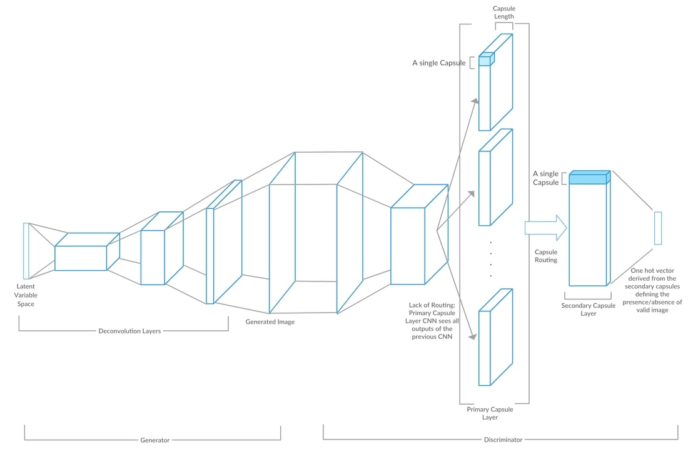

# CapsuleGAN
Improving Generative Adversarial Networks using CapsuleNet

## Introduction
In our project, we aimed to enhance the performance of Generative Adversarial Networks (GANs) by incorporating Capsule Networks (CapsuleNets) as discriminators. The motivation for this project stemmed from the limitations of Convolutional Neural Networks (CNNs) and the potential of CapsuleNets to address these issues. We hypothesized that this new architecture would provide us with better generative abilities than traditional Deep Convolutional GANs (DCGANs)

Hinton's CapsuleNET has outperformed the traditional CNNs in many ways:
* cut error rate by 45% as compared to the previous state 
* only using a fraction of the data that a CNN would use
* preserve hierarchical pose relationships between object parts - numerically as a 4D pose matrix.
* Translation, rotation, scale invariant.
* Capsules encapsulate all important information about the state of the feature they are detecting, in vector form.

## Methodology

### DCGAN - CNN as Generator
DCGAN has proveb to be the most stable and robust architecture in the GAN perspective. Also, it provides for faster learning which in turn enables our CapsuleGAN for faster convergence.

### CapsuleNET as Discriminator
In our architure, we intend to incorporate a strong discriminator compared to the generator so that the discriminator can learn wuickly and aid the generator for accurate and fast learning. Therefore, CapsuleNET has been the preferred choice. Also, CapsuleNET is less time and resource consuming when used as a discriminator than the generator.

CapsuleNET as the generator has been much slower and the discriminator outperforms the generator every time; hence
the learning of discriminator is not proper. 

Hence the most effective choice is DCGAN-CNN as Generator alongwith CapsuleNET as Discriminator.

_A generalised representation of CapsuleGAN Architecture_

The details of the architecture of Capsule Networks, and the GAN model are provided in the report. It also covers the architecture of the CapsuleNET discriminator and the DCGAN generator, the loss functions used, the integrated CapsuleGAN architecture, and the training process.

## Conclusion
In conclusion, the project demonstrates the effectiveness of CapsuleGAN in modeling image data distribution, outperforming the traditional DCGAN on the MNIST dataset. The contribution of the project lies in the improved generative abilities of CapsuleGAN compared to traditional DCGANs. The impact of this project is in enhancing the performance of the discriminator, leading to better quality generated images.

For the complete technical details, including the architecture of Capsule Networks, the GAN model, and the experimental results, please refer to the project report and presentation